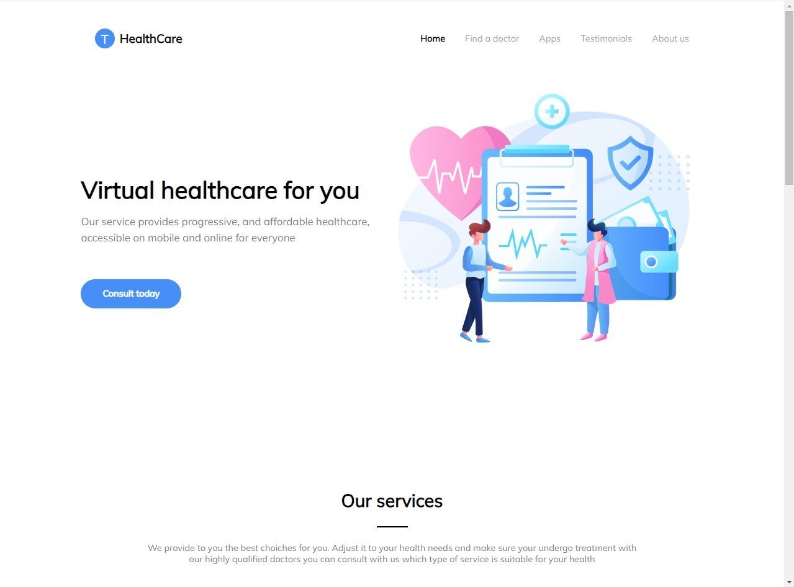
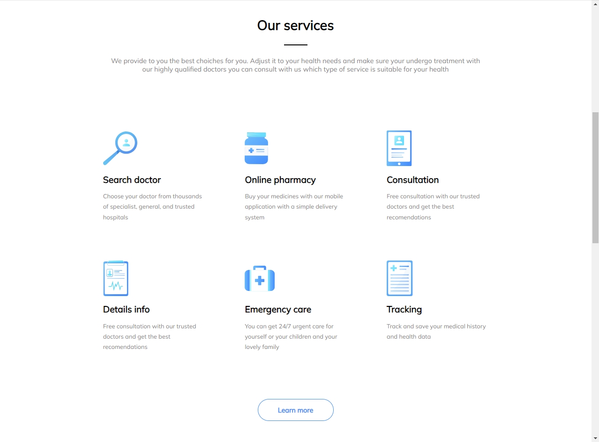
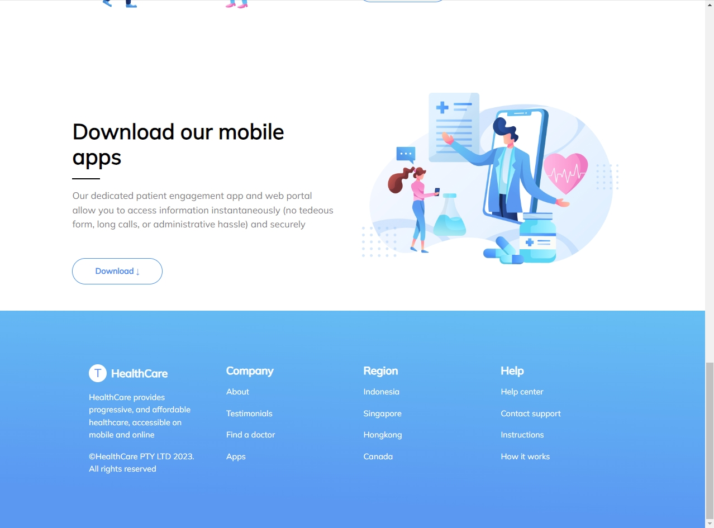

# Лабораторная работа 1 по Web

<u>*Задание*</u>: реализовать страницу по следующему [макету](https://www.figma.com/file/4HxKAipeUl0XV4poXyxvnv/Effective-Web-Course?type=design&node-id=0%3A1&mode=design&t=GfYlgxxz2848kWNs-1). 

В ходе разработки использовались React, TypeSript и Vite.

Версия npm: 10.2.5

Чтобы запустить проект, необходимо клонировать репозиторий командой ниже

```git
git clone https://github.com/juliazubova/effective_web.git effective_web  --branch feature/health-care
```

Сначала необходимо установить все зависимости командой npm install, а затем можно запустить и собрать проект.

```
npm install
npm run dev "&" run build
```

<u>*Результат*</u>: 


|||
|:-:|:-:|
||| 